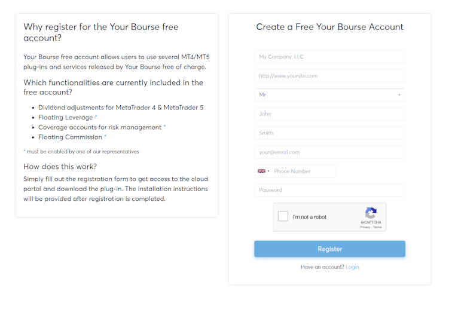
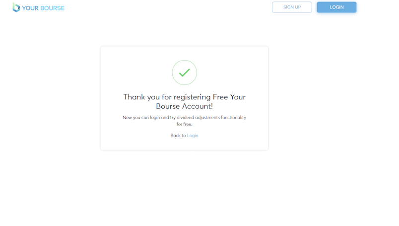

## Github - Candidate Evaluation (QA Manual)

Your task is to write test cases for the request described below. Once the test cases are defined, please execute and document all steps needed to achieve the requirement.

 

##  Scope

A company would like you to test the main entry point into the application: https://cloud.test.yourbourse.com/free-account 

1. Task 1: Perform an exploratory test of the `Create a Free Account` page.

 

The successful criteria would be a confirmation message that the account was created and an email was sent to the provided email address.

 

2. Task 2: Once the exploratory testing is completed, you were asked to write `Test Cases` assuming that another QA will use them within the company.

3. Task 3: Perform a `Test Run` (execution) of the created test cases.

4. Task 4: Suggest how to improve the `user experience` and all list potential issues the user might face during the account creation.

## Out of scope
 

1. Testing of any other pages is not required

1. Don't record any video

## Additional Comments

Please document any assumptions, notes, or considerations you make in the [Assumptions.md](Assumptions.md) file in the root of the repository. 
Please also document any libraries or tools you use to complete the task in this file; a note on why you chose some of the libraries over an alternative would be appreciated.

It's expected for you to spend no more than 2 hours on this work, but please regularly commit so we can see the approach you take to get to the end result.

----

#### Please host your solution in a public repository of a platform such as GitHub, and upon completion, a link should be sent to us.

 